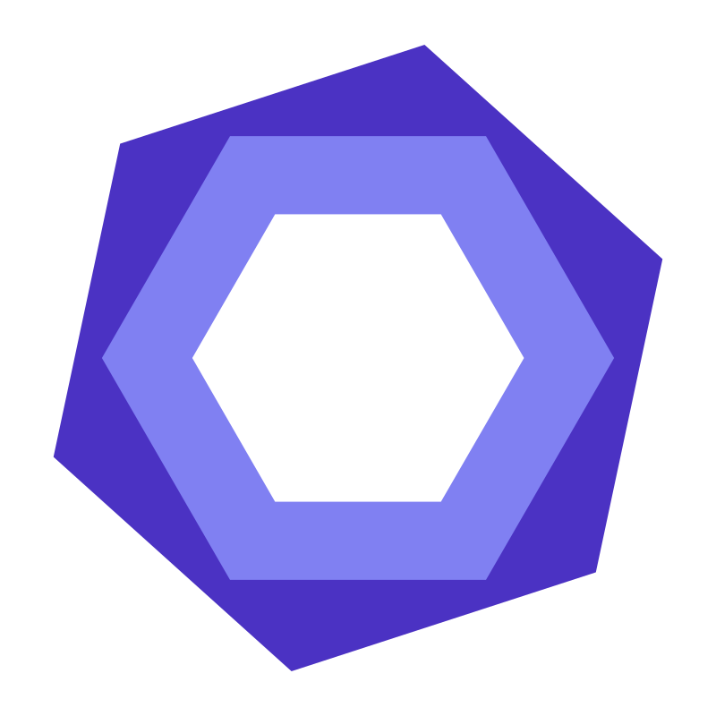

<h1>
    Hi there, I'm Andrey 👋
    

</h1>

---

### 👨🏼‍💻 About Me:

Passionate Software Developer

---

### 🌍 Languages :

<table  align="center">
<tr>

    🇺🇦 Russian - Native

</tr>

<tr>

    🇺🇦 Ukrainian - Native

</tr>

<tr> 

    🇪🇸 Spanish - B2

</tr>
<tr>

    🇬🇧 English - B2

</tr>
<tr>

    🇩🇪 German - B1

</tr>
</table>

---

### Programming Languages:

<table align="center">
  <tr>
     <td align="center"  width="88">
         
       TypeScript
    </td>
    <td align="center" width="88">
        
       JavaScript
    </td>
<td align="center" width="88">
         
       Java
    </td>
<td align="center" width="88">
         
       Python
    </td>
</table>

### Frontend Development:

<table align="center">
  <tr>
     <td align="center"  width="88">
         
       HTML5
    </td>
    <td align="center" width="88">
        
       CSS3
    </td>
<td align="center" width="88">
         
       Sass
    </td>
<td align="center" width="88">
         
       Tailwind
    </td>
<td align="center" width="88">
         
       Material UI
    </td>
<td align="center" width="88">
         
       Ant Design
    </td>
<td align="center" width="88">
         
       Bootstrap
    </td>
</table>

<table align="center">
  <tr>
     <td align="center"  width="88">
         
       React/React Native
    </td>
<td align="center" width="88">
         
       Redux
    </td>
<td align="center" width="88">
         
       GraphQL
    </td>
<td align="center" width="88">
         
       Formik
    </td>
<td align="center" width="88">
         
       Axios
    </td>
<td align="center" width="88">
         
       Apollo
    </td>
    <td align="center" width="88">
        
       Socket.io
    </td>
</table>

<table align="center">
  <tr>
     <td align="center"  width="88">
         
       Angular
    </td>
<td align="center" width="88">
         
       RxJs
    </td>
<td align="center" width="88">
         
       Ngrx
    </td>
<td align="center" width="88">
         
       NextJS
    </td>
<td align="center" width="88">
         
       Android SDK
    </td>
</table>

### Backend Development:

<table align="center">
  <tr>
     <td align="center"  width="88">
         
       NodeJS
    </td>
<td align="center" width="88">
         
       NestJS
    </td>
<td align="center" width="88">
         
       Prisma
    </td>
<td align="center" width="88">
         
       Express
    </td>
<td align="center" width="88">
         
       Django
    </td>

</table>

### Databases:

<table align="center">
  <tr>
     <td align="center"  width="88">
         
       PostgreSQL
    </td>
<td align="center" width="88">
         
       Firebase
    </td>
<td align="center" width="88">
         
       SQLite3
    </td>

</table>

### Testing:

<table align="center">
  <tr>
     <td align="center"  width="88">
         
       Jest
    </td>
<td align="center" width="88">
         
       Pytest
    </td>

</table>

### Development Tools:

<table align="center">
  <tr>
     <td align="center"  width="88">
         
       Intellij IDEA
    </td>
<td align="center" width="88">
         
       Pycharm IDEA
    </td>
    <td align="center" width="88">
         
       Android Studio
    </td>
    <td align="center" width="88">
         
       Github
    </td>
    <td align="center" width="88">
         
       Git
    </td>
    <td align="center" width="88">
         
       Eslint
    </td>
    <td align="center" width="88">
         
       Prettier
    </td>
</table>

<table align="center">
    <td align="center" width="88">
         
       Storybook
    </td>
    <td align="center" width="88">
         
       Webpack
    </td>
    <td align="center" width="88">
         
       Gulp
    </td>
    <td align="center" width="88">
         
       Postman
    </td>

</table>

---

### 📊 My Stat:

